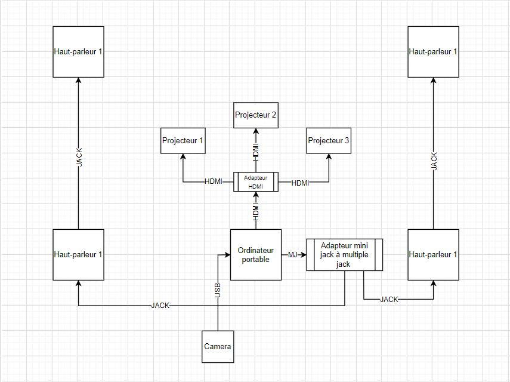
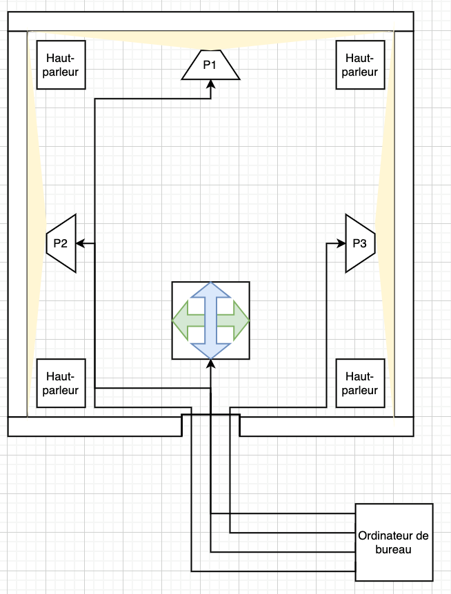

# Préproduction

# Table des matières
1. [Intention ou concept](#Intention-ou-concept)
    - [Synopsis](#Synopsis)
    - [Intention de départ](#Intention-de-départ)
    - [Tableau d'ambiance (*moodboard*)](#Tableau-d'ambiance-(*moodboard*))
    - [Scénario, scénarimage ou document audio/visuel](#Scénario,-scénarimage-ou-document-audio/visuel)
2. [Contenu multimédia à intégrer](#Contenu-multimédia-à-intégrer)
    - [Inventaire du contenu multimédia](#Inventaire-du-contenu-multimédia)
    - [Univers artistique des éléments](#Univers-artistique-des-éléments-centraux)
3. [Planification technique (devis technique)](#Planification-technique-(devis-technique))
    - [Schémas ou plans techniques](#Schémas-ou-plans-techniques)
    - [Matériaux requis](#Matériaux-de-scénographie-requis)
    - [Équipements requis](#Équipements-requis)
    - [Logiciels requis](#Logiciels-requis)
    - [Ressources humaines requises](#Ressources-humaines-requises)
    - [Ressources spatiales requises (rangement et locaux)](#Ressources-spatiales-requises-(rangement-et-locaux))
4. [Planification de la production (budget et étapes de réalisation)](#Planification-de-la-production-(budget-et-étapes-de-réalisation))
    - [Budget prévisionnel](#Budget-prévisionnel)
    - [Échéancier global](#Échéancier-global)
    - [Liste des tâches à réaliser](#Liste-des-tâches-à-réaliser)
    - [Rôles et responsabilités des membres de l'équipe](#Rôles-et-responsabilités-des-membres-de-l'équipe)
    - [Moments des rencontres d'équipe](#Moments-des-rencontres-d'équipe)

# Intention ou concept
## Synopsis
Notre projet consiste en une simulation d’une vie à l’étude. Un étudiant court le long de son chemin académique et rencontre des obstacles, tels que les réseaux sociaux, la pandémie, l’Internet et les mauvaises notes dans son chemin à la réussite. Si le personnage réussi à prendre trois A, il gagne la partie. Au contraire, s’il prend trois F, il échoue ses études.

## Intention de départ
Avec la situation de pandémie, les études sont encore plus stressantes et démotivantes. Nous avons donc pensé qu'un jeu avec une approche humoristique serait une bonne idée pour remonter le moral des étudiants. C'est également un façon de faire comprendre comment nous pouvons nous sentir face à ce qui se passe dans le monde en ce moment.

## Tableau d'ambiance (*moodboard*)

## Scénario, scénarimage ou document audio/visuel
[Exemple de scénarimage visuel pour vidéo d'animation](https://cmontmorency365.sharepoint.com/sites/TIM-58266B-Expriencemultimdiainteractive-Enseignants/Documents%20partages/Enseignants/hiv2021_expMulti_582-66BMO/4_Contenu/Modeles/scenarimage/storyboard_animation_exemple2.pdf)

# Contenu multimédia à intégrer
## Inventaire du contenu multimédia

- 1 vidéo d'animation 2D (Vidéo de veille)
- 6 montages vidéo (Netflix, COVID, A+, F, Fin A+, Fin F)
- 4 paysages sonores (Début, Jeu, Fin A+, Fin F)
- 10 enregistrements vocaux (Pour les messages F et A)

Pour plus de détails: [Inventaire du contenu à intégrer](https://cmontmorency365.sharepoint.com/sites/TIM-58266B-Expriencemultimdiainteractive-Enseignants/_layouts/15/Doc.aspx?OR=teams&action=edit&sourcedoc={8D242B82-E599-49CF-BE4C-EA9539D2D1C3})

## Univers artistique des éléments
Voir colonne *Exemples de réalisation* dans l'[Inventaire du contenu à intégrer](https://cmontmorency365.sharepoint.com/sites/TIM-58266B-Expriencemultimdiainteractive-Enseignants/_layouts/15/Doc.aspx?OR=teams&action=edit&sourcedoc={8D242B82-E599-49CF-BE4C-EA9539D2D1C3}).
(https://docs.google.com/spreadsheets/d/1aTiW2BlDx6qbVfFpZxfX0-r6PjeXfDaRXsAZI6QH6Ho/edit#gid=0})

# Planification technique (devis technique)
## Schémas ou plans techniques

### Schéma de branchement 

### Plantation 

## Matériel de scénographie requis

> Liste des matériaux de scénographie (matériaux de décor) requis ou lien vers un tableur Excel ou document Markdown à part si nécessaire (quantité, spécifications techniques, lien vers fiche technique si applicable, commentaires...)

* Rideaux blanc opaque
* Tapis Dance Dance

## Équipements requis

* Audio
    * 4 haut-parleurs"
    * 4 fils XLR 3 conducteurs de 15' (M->F)
    * Interface audio USB disposant 4 sorties
    * 1 fil mini jack 
    * 4 fils jack

* Vidéo
    * 3 projecteurs vidéo lentille standard
    * 3 système d'acrochage
    * Caméra

* Électricité
    * 4 cordon IEC (pour l'alimentation des haut-parleurs)
    * 2 extentions 3 fiches et 3 conducteurs 
    * 2 multiprise

* Réseau
    * 4 fils cat6a de 15"
    * Switch poe 5 ports

* Ordinateur
    * 1 ordinateur de bureau
    
* Autre
    * Tout autre élément pertinent

## Logiciels requis

* [Max 8](https://cycling74.com/products/max)   
* [Unity 2019 lts](https://unity.com/)
* [Madmapper](https://madmapper.com/)
* [Adobe Premiere](https://www.adobe.com/ca_fr/products/premiere.html)
* [Adobe After Effects](https://www.adobe.com/ca/products/aftereffects.html)

## Ressources humaines requises

* 10 février, TTP, location de matériel 
* 26 mars, TTP, retour du matériel
* 13 février, Mélanie Simard, enregistrement des voix

## Ressources spatiales requises (rangement et locaux)

* Réservation d'un salle de classe 
    * La classe doit mesurer environ :
    * Les murs doivent être blanc (ou une couleur proche, comme gris très pâle);
    * Si possible, la classe doit contenir des haut-parleurs et des projecteurs (3);
    * Proche du grand studio;
    * Possibilité de vider la classe;
    * Être disponible du 10 février aux 26 mars pour : 
        * Planification de l'espace d'installation
        * Essais des projection 
        * Projection vidéo sur les murs   
    
# Planification de la production (budget et étapes de réalisation)
## Budget prévisionnel

[Lien vers le document](https://cmontmorency365-my.sharepoint.com/:x:/r/personal/1444975_cmontmorency_qc_ca1/_layouts/15/Doc.aspx?sourcedoc=%7B8FB80709-6FD5-42B0-8CD6-E6A511334527%7D&file=Classeur%201.xlsx&action=default&mobileredirect=true)

## Échéancier global
Étapes importantes du projet visualisées dans GitHub (*milestones*):  
https://github.com/pamelasanscartier/school_run/milestones

*Dates importantes de diffusion :*
- Pratique générale : vendredi 19 mars (toute la journée)
- Début de la diffusion : lundi 22 mars
- Présentation des projets devant public : jeudi 25 mars (soir)

## Liste des tâches à réaliser
Visualisation des tâches à réaliser dans GitHub selon la méthode Kanban:  
https://github.com/pamelasanscartier/school_run/projects/1

Inventaire des tâches à réaliser dans GitHub selon le répertoire d'*issues*:  
https://github.com/pamelasanscartier/school_run/issues

## Rôles et responsabilités des membres de l'équipe

### **Pamela**
- **Coordination générale du projet (coordination de l'échéancier, du budget, suivi de la liste des tâches à réaliser, s'assurer de la répartition du rôle et des responsabilités des membres de l'équipe)**;
- Installation de l'équipement dans l'espace physique.
- **Coordination artistique (attention plus particulière pour s'assurer que l'intention/concept artistique du projet initial reste, sinon consulter les membres de l'équipe)**;
- Montage vidéo des effets visuels;
- Programmation des personnalisations dans Unity;
- Enregistrement des voix.

Liste des tâches dans Git Hub:  
https://github.com/pamelasanscartier/school_run/projects/1?card_filter_query=assignee%3Apamelasanscartier
https://github.com/pamelasanscartier/school_run/issues?q=is%3Aopen+assignee%3Apamelasanscartier 

### **Jan Carlos**
- **Comité Technique et coordination technique (suivi du devis technique)**;
- Création du plan de l'installation physique;
- Création des paysages sonores;
- Programmation du module Max d'effet et de contrôle audio dans la classe;
- Programmation du module Max de contrôle vidéo dans la classe;
- Programmation des fonctions de base dans Unity.

Liste des tâches dans Git Hub:  
https://github.com/pamelasanscartier/school_run/projects/1?card_filter_query=assignee%3Ajanki000 
https://github.com/pamelasanscartier/school_run/issues?q=is%3Aopen+assignee%3Ajanki000

### **David**
- **Comité Diffusion et coordination de la diffusion (mise en ligne du Site Web, organisation de la plateforme et de l'événement de diffusion)**;
- Installation et mise en place de la capture audiovidéo du projet en temps réel;
- Programmation du module de captation des données;
- Programmation du module de diffusion et d'interaction en ligne (page Web, diffusion vidéo dans Twitch via OBS, interface utilisateur dans Open Stage Control);
- Montage vidéo des effets visuels;
- Création des vidéos d'animations 2D;

Liste des tâches dans Git Hub:  
https://github.com/pamelasanscartier/school_run/projects/1?card_filter_query=assignee%3Acapkidd1
https://github.com/pamelasanscartier/school_run/issues?q=is%3Aopen+assignee%3ACapKidd1

**Tâches pas encore attribuées**  
https://github.com/pamelasanscartier/school_run/issues?q=is%3Aopen+is%3Aissue+no%3Aassignee+

## Moments des rencontres d'équipe
Quotidien
- **Chaque jour 8h30 (30min max)**: Rencontre statutaire d'équipe pour régler les urgences et pour mettre au clair ce que chaque personne doit faire pendant la journée.

Hebdomadaire
- **Mardi 11h00 (environ 1h)** : Rencontre d'équipe avec professeur
- **Vendredi 9h50 (environ 2h)** : Rencontre générale de classe
- **Vendredi 13h00 (environ 2h)** : Rencontre de mise à jour d'équipe (Journal Web, suivis, mise à jour de l'échéancier, partage des tâches et autres)

Autre: 
- **Jeudi 10h00 (environ 1h30)** : Comité Diffusion (David)
- **Jeudi 14h00 (environ 1h30)** : Comité Technique (Jan)
